 

  
<h1 align="center"><strong>Eager Beaver</strong></h1>
  

     
    

       
       
       
       
        
      
      
       
       
       
      
      
    

     
  

 

# 목차

1. [**서비스 소개**](#1)
2. [**기획 배경**](#2)
3. [**기능 소개**](#3)
4. [**시연 영상**](#4)
5. [**기술 스택**](#5)
6. [**프로젝트 일정 및 산출물**](#6)
7. [**개발 멤버**](#7)

 

---

 

# 1. 서비스 소개

## 서비스 설명

### 개요

- 한줄 소개 : **시뮬레이션 게임**을 통해 **부동산** 지식을 습득할 수 있는 웹 서비스
- 서비스 명 : **`Eager Beaver(이거비버)`**

### 타겟 🎯

- 부동산에 대한 지식을 습득하고 싶은 2030 세대
- 뉴스 기사와 부동산 간에 상관관계가 궁금한 사람들
- 게임을 통해 재밌게 공부하고 싶은 사람들
 
 
 

# 2. 기획 배경

## 배경

2030 세대 설문조사 결과 '내 집 마련 필요'를 응답한 비율이 95% 일 정도로 자가 마련에 대한 기대가 높습니다.
 
하지만 부동산 용어나 관련 뉴스들을 쉽게 접해볼 수 없고, 공부해 볼 기회 조차 얻기 어렵습니다.
 

 
따라서 재미있게 게임을 하며 부동산 지식을 얻을 수 있는 웹 게임 서비스를 개발하였습니다.
 
 

## 목적 🥅

**게임을 통해 부동산 지식을 쉽게 배우자**

## 의의

- 게임 시뮬레이션 기능
- 실시간 랭킹, 부동산 용어, 검색 기능
- 실제 뉴스, 실거래 매매 데이터 적용

 
 

# 3. 기능 소개

### 시작 페이지
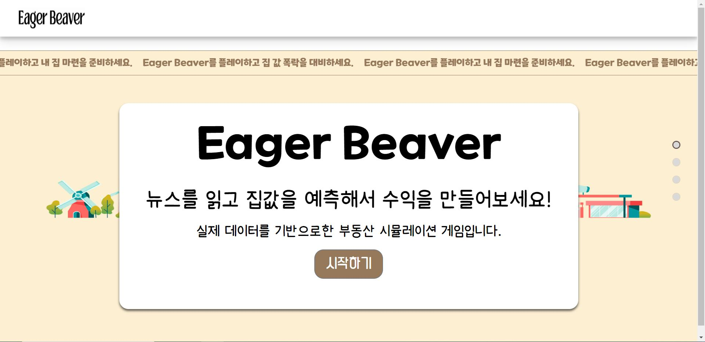
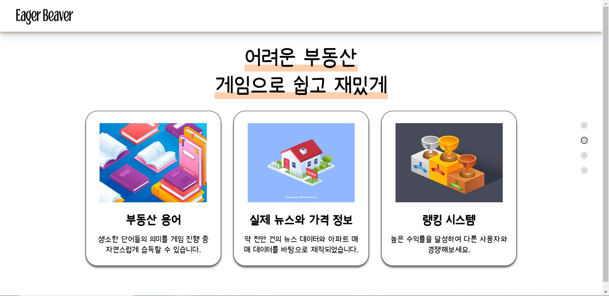
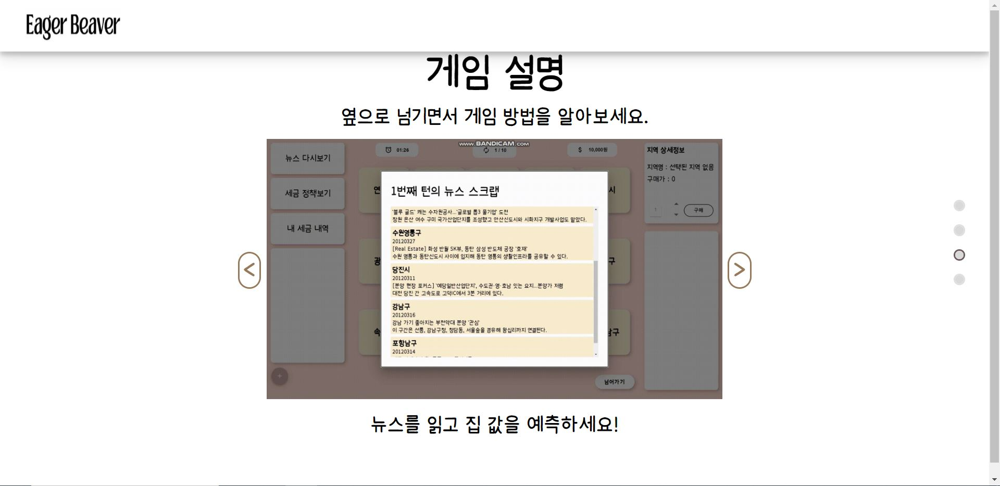
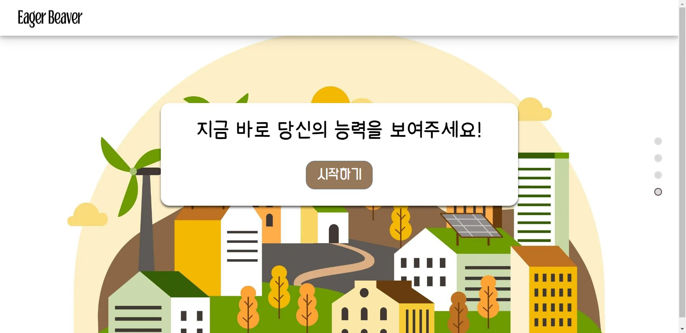
### 닉네임, 프로필 편집
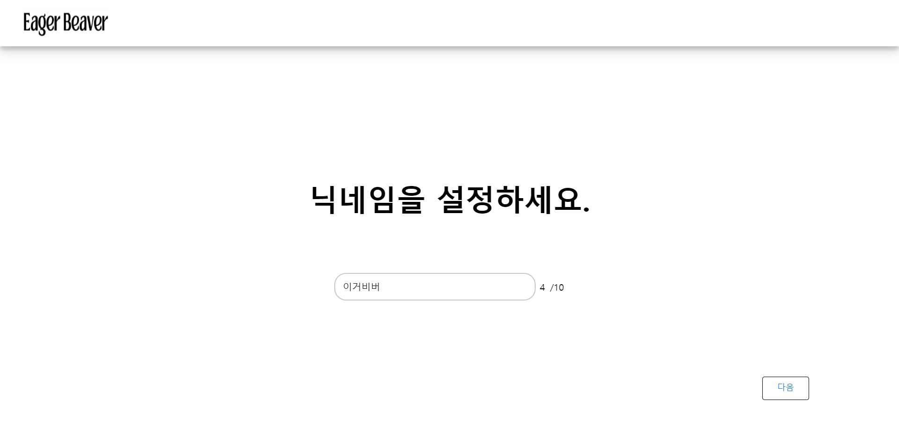
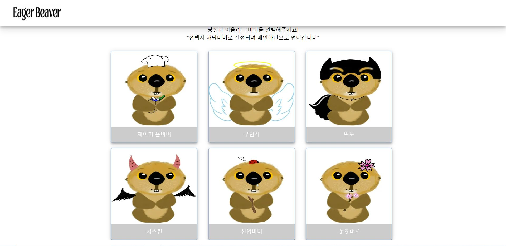
### 메인 페이지

### 게임 페이지
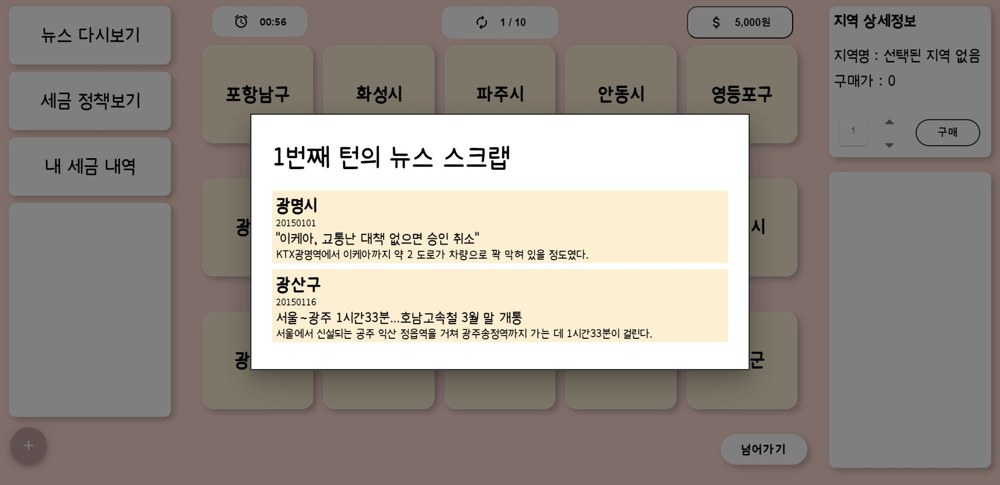
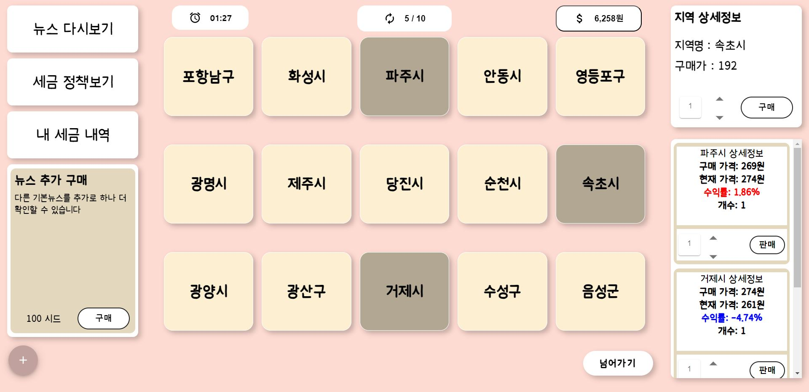
### 결과 페이지
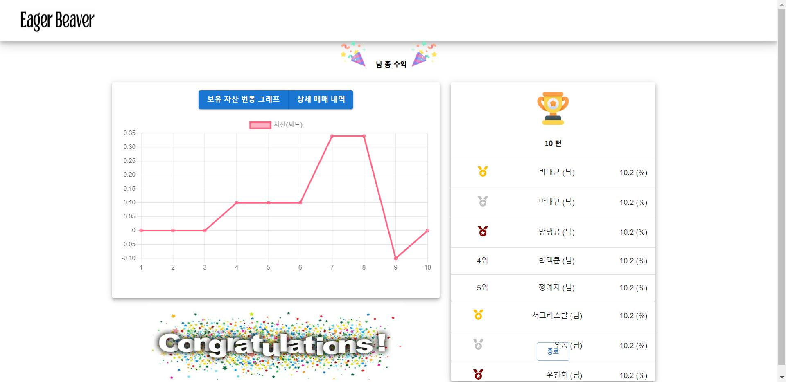

 
 

# 4. 시연 영상

 
 

# 5. 기술 스택

## 1.  Hadoop & Spark

### Hadoop 이란?

<aside>
여러 대의 컴퓨터 클러스터에서 대규모 데이터 세트를 분산처리할 수 있게 해주는 프레임워크 입니다.

</aside>
단일 서벙에서 수천 대의 머신으로 확장할 수 있도록 설계되어있습니다.

 

### Spark 란?

<aside>
SQL, 스트림 처리, 머신러닝, 그래프 계산을 위한 라이브러리

</aside>
Hadoop의 맵리듀스보다 100배 빠른 속도로 워크로드를 실행할 수 있습니다.

### 적용

`Eagere Beaver` 에서는 2,000,000만건의 뉴스 데이터를 전처리 하기 위하여 Hadoop과 Spark를 사용하여 보다 빠르고 효율적인 분석을 진행하였습니다.

 
 

# 6. 프로젝트 진행 및 산출물

## 프로젝트 진행
### 1. Git flow
---
front 와 back 으로 나누어 `faature`의 하위 브랜치를 사용하였으며 매일 오전 스크럼 이후 `back` 브랜치와 `front` 브랜치로 merge 하여 사용했습니다. 
`commit message`는 `feat: 채팅방 구현` 과 같이 통일하여 작성했습니다. 

### 2. Jira
---
매주 월요일 오전 회의에서 금주의 진행 이슈를 백로그에 등록했습니다. 전주에 완료하지 못한 이슈나, 앞으로 진행할 이슈들을 추가합니다.
- 레이블은 BE, FE로 구성했습니다.
- 작업현황을 실시간으로 지라에 반영하여 현재 팀원이 어떤 작업을 하고있는지, 일정에 딜레이가 있는지 한 눈에 알아볼 수 있게 했습니다. 

## 프로젝트 산출물

### 1. ERD
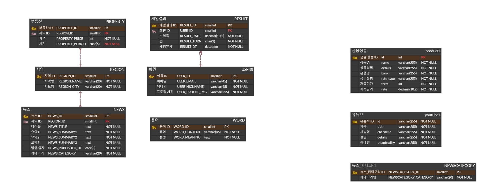
 

### 2. API 문서
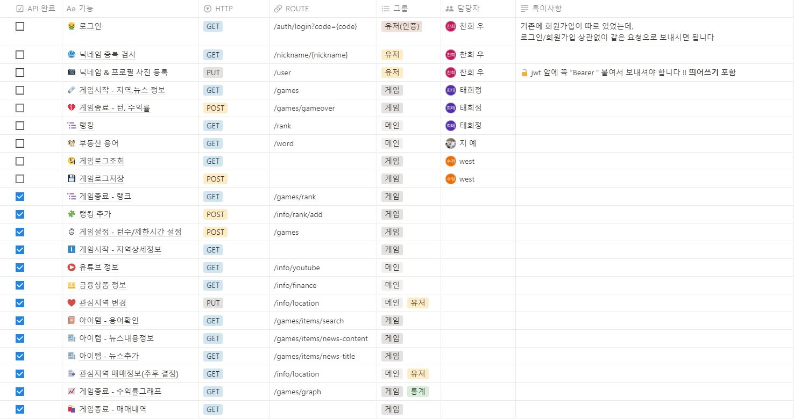

 
 

# 7. 개발 멤버

  <table align="center">
    <tr>
      <td align="center"><a href="https://github.com/J-Heetae">정태희(팀장)</td>
      <td align="center"><a href="https://github.com/9minseok">구민석</td>
      <td align="center"><a href="https://github.com/daegyunpark">박대균</td>
      <td align="center"><a href="https://github.com/ssj946">서수정</td>
      <td align="center"><a href="https://github.com/dener8">우찬희</td>
      <td align="center"><a href="https://github.com/ityeji">정예지</td>
    </tr>
    <tr>
      <td align="center"></td>
      <td align="center"></td>
      <td align="center"></td>
      <td align="center"></td>
      <td align="center"></td>
      <td align="center"></td>
    </tr>
    <tr>
      <td align="center">BE, Hadoop</td>
      <td align="center">FE, Hadoop</td>
      <td align="center">FE, Hadoop</td>
      <td align="center">FE, CI/CD</td>
      <td align="center">BE, CI/CD</td>
      <td align="center">BE, Hadoop</td>
    </tr>
  </table>

