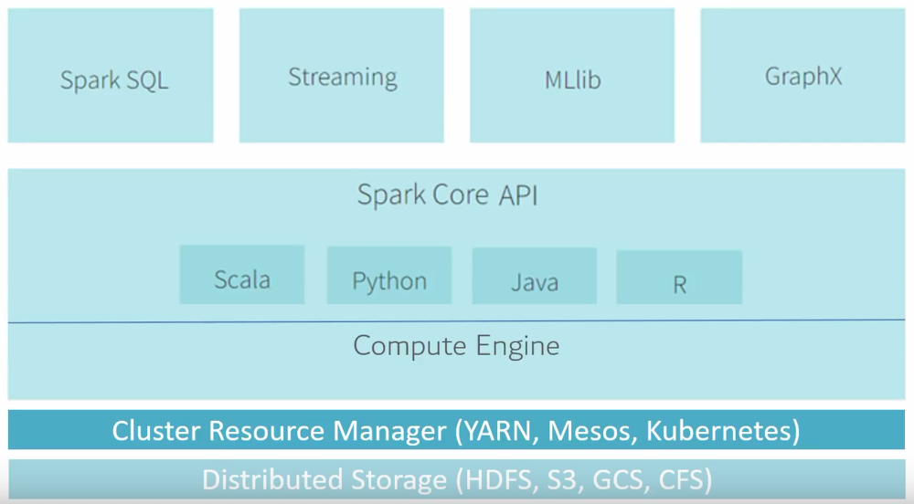

# 2일차 개인학습

## Apache Spark

- 간단한 데이터 읽기에서부터 SQL 처리, 머신러닝 그리고 스트림 처리 등 여러 라이브러리를 결합해 수행
## 등장 배경

- 빅데이터 문제를 해결하기 위해 Hadoop 등장
- 하둡은 HDFS 파일시스템, Yarn 리소스관리, MR 연산처리
- 하둡의 문제점 : 연산처리 방식 -> HDFS는 DISK I/O를 기반으로 실시간성의 데이터를 처리하지 못함
- Spark는 인메모리 방식의 연산처리를 지향하면서 MR의 연산 속도의 한계를 극복
- MR을 사용하지 않고 Spark를 사용하는 이유 : 빅데이터를 연산처리 할 때 DISK I/O로 처리하는 것이 아니라 인메모리로 처리하기 때문에 실시간 스트리밍이 가능할 만큼 속도가 빠르기 때문

## 처리방식

- Spark는 Driver Program, Cluster Manager, Worker Node로 구성
- Cluster Manager가 Worker Node를 알아서 CPU로 할당하여 분산 처리를 하기 때문에 연산 속도가 빠름

## 구조

- SQL 기능을 담당하는 Spark SQL
- 실시간 데이터 처리를 지원하는 Spark Streaming
- 여러 머신러닝 기법을 지원하는 MLlib
- 그래프 기법을 지원하는 GraphX

- 또한 Kafka, Hadoop과의 연계 가능한 스파크의 확장성
- 카프카, 플럼, 키네시스, TCP 소켓 등 다양한 경로를 통해 데이터를 입력 받고, MR, window 등의 연산을 통해 데이터를 분석하여 최종적으로 파일시스템, 데이터베이스 등에 적재